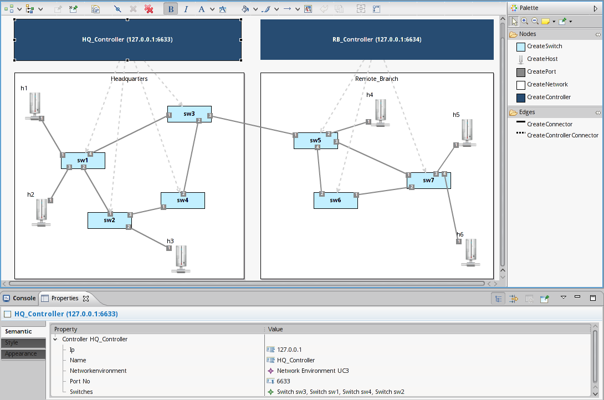
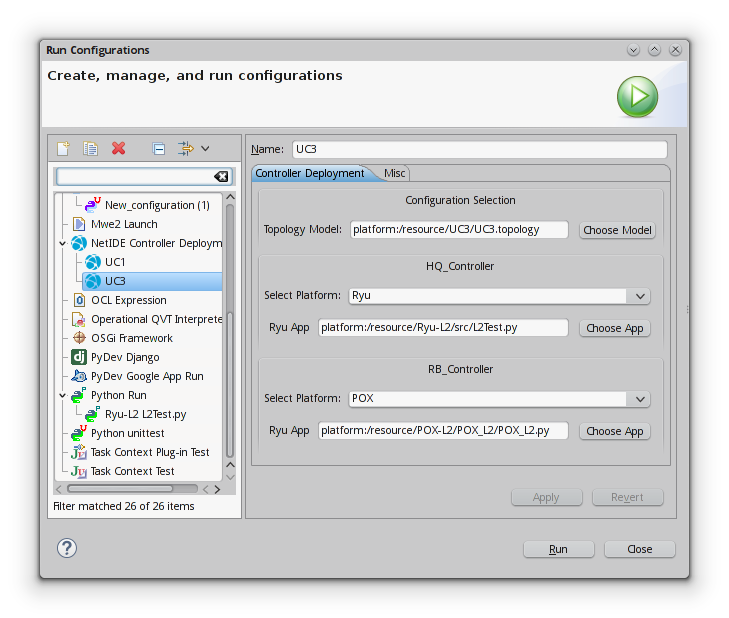

# NetIDE Eclipse Plug-Ins

This Repository contains the plug-ins needed for a graphical network editing and the generation of platform-specific code.

## Installation

### Requirements

In order to use NetIDE to the full extend, you need to install [VirtualBox](http://virtualbox.org) and [Vagrant](http://www.vagrantup.com). NetIDE deploys your network apps on virtual machines which are set up and managed with vagrant.

In order to execute commands on your VM through the IDE, you also need an installation of SSH. If you are running Windows, make sure that your ssh executable is referenced in the PATH variable.

You'll also need at least Java 7.

### Set up Eclipse

1. Download Eclipse Mars or Luna Modeling Tools at www.eclipse.org.
2. Start Eclipse and open the Git Perspective.
3. From the window menu, select `Help -> Install Modeling Components`. Select and install Sirius and Xtext.
4. Go to `Help -> Eclipse Marketplace...`, search for and install TM Terminal.
5. Clone or add this repository and import all projects from the "plugins"-folder into your workspace. To do so, enter to the folder "Working Directory", right-click on the folder "plugins" and select "Import Projects". Follow the steps in the wizard.
6. Open the Plug-In Development perspective and open eu.netide.configuration/model/Topology.genmodel
7. Right-click the root element in the tree view and select `Generate All`
8. For both projects "eu.netide.parameters.language" and "eu.netide.sysreq", do the following:
    1. Find the \*.mwe2 file in the source folder.
    2. Right-click on the mwe2 file and select "Run As -> MWE2 Workflow". A dialog box should pop up informing you about errors in the project. Click "Proceed".
    3. A console view in the bottom region will appear and ask you to install the Antlr parser. Type "y" into the console and hit Return.
9. Right-click the project eu.netide.configuration and select `Run As -> Eclipse Application`
10. If you want to develop your Python-based controllers in Eclipse as well, you can install the [PyDev](http://www.pydev.org/) plug-in for Eclipse from the Eclipse Marketplace.

## Usage

### Create and edit a network model

In order to model network environments, we first need a new modeling project and a new network model.

1. Open the NetIDE perspective.
2. Right-click the Model Explorer view and select "New -> Modeling Project"
3. Right-click the newly created project and select "New -> Other". From the thereby opened view, select "Example EMF Model Creation Wizards -> Topology Model". Give it a name and select Network Environment as the Model Object.
4. Right-click your modeling project again and choose "Viewpoints Selection". From there, choose "Topology".
5. Expand your model in the Model Explorer, right-click the Network Environment and select "New Representation -> new NetworkEnvironment".
6. There is your graphical editor.

The first thing to do now is to define a network. Click on "Create Network" in the toolbox and draw a rectangle on the canvas to create a network. Here, you can place switches and hosts, add ports to them and connect them. You can create controllers outside of the networks and connect them to switches.

### Generate Mininet configurations

Once you have modeled a network environment, you might want to generate a mininet configuration for simulation purposes. Here is how it works:

1. Expand your topology model in the Model Explorer
2. Right-click the Network Environment model
3. Select "Generate Mininet Configuration"
4. A folder named "gen/mininet" containing a configuration class should appear in your modeling project.

### Launch a network app

You can launch your network app on the topology you just specified as follows:

1. Switch to the Java or PyDev perspective.
2. In the window menu, select "Run -> Debug Configurations"
3. Right-click "NetIDE Controller Deployment" in the left pane and select "New".
4. Click "Choose Model" and enter the location of your topology model.
5. For each controller, you can now select a platform and the location of your app.
   *WARNING: Currently, only POX, Ryu, Pyretic, and the Network Engine with ODL and POX as a server controller actually work.*
6. Once everything is configured, click "Debug".
7. NetIDE will set up and start a VM. This is going to take some time for the first run.
8. Once the setup process is finished, you can access mininet and the controller output in the Eclipse console.
9. After testing your app, you can end it by clicking the red square in the console view.

## Examples

For examples, have a look at the examples folder. You can import the examples into your runtime workspace from there.

## Troubleshooting

### Configuration generation does not work

NetIDE is not yet compatible to the newest versions of Xtend. We recommend using version 2.7.3.

### Vagrant does not start when running a launch configuration

If Vagrant displays the error message `The box 'ubuntu/trusty32' could not be found`, make sure you have installed a recent version of vagrant. For example, the version in the repositories for Ubuntu 14.04 LTS (1.4.3-1) is too old. After upgrading Vagrant, it may be necessary to remove the directory `~/.vagrant.d`.

If your vagrant executable is not in a standard location (`/usr/bin/vagrant` or `C:\Hashicorp\Vagrant\bin\vagrant.exe`) you have to enter your custom location under "Window -> Preferences -> NetIDE".

### Generating mininet configurations fails with "The chosen operation is not currently available"

This error occurs if the projects in the `plugins`-folder have not been imported properly. They have to be imported as Projects, or, in the case of `eu.netide.configuration`, as General Projects. The simplest way to do this is to right-click the `plugins`-folder in the Git perspective and choosing "Import Projects..." from the menu.

### Compiler errors after pulling

The code you just pulled may use a more recent version of the Topology meta-model. If you run into compiler errors, just repeat step 5 and 6 from the Installation guide. This generates new model code from the newest version of the meta-model.

### Large amounts of disk space used

NetIDE creates a VM for each topology modeling project to set up a clean simulation environment. Delete the gen folder in your project and open the Virtualbox GUI to delete the VM completely, once you do not need it anymore.
